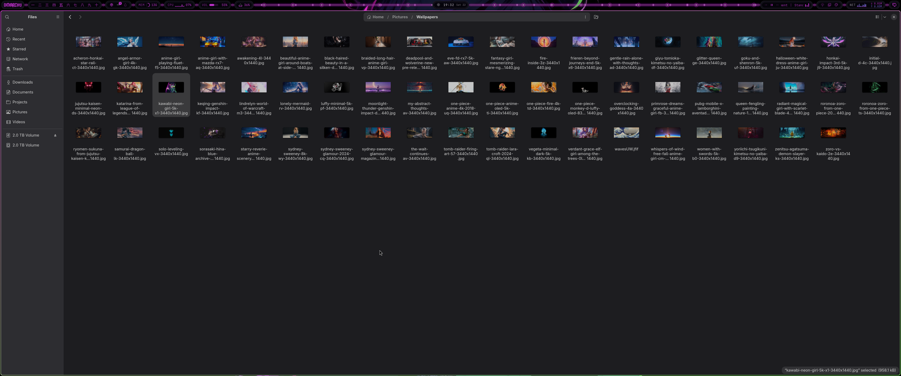
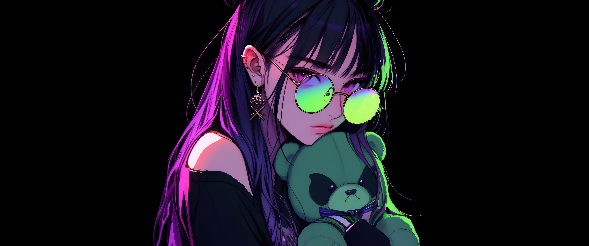

# Omarchy Kawabi Neon Theme

Kawabi Neon is a dark palette sampled directly from the *kawabi-neon-girl* wallpaper: pure-black background, neon magenta from the hair, neon green from the glasses and teddy bear, and a deep purple shadow accent. Animations and window gaps are matched to the Primrose theme (`gaps_in = 2`, `gaps_out = 2`), and corner rounding is matched to the X-1632 theme (`rounding = 22`, `rounding_power = 1`).

## Preview



## Install

```bash
omarchy theme install https://github.com/Korgen-Jurai/omarchy-kawabi-neon-theme.git
```

## What's included

- Terminal palette (`colors.toml`) — drives Alacritty, Kitty, Foot, Ghostty, btop, VS Code, Obsidian, and more via Omarchy's built-in templates
- Hyprland gaps/borders/rounding/animations (`hyprland.lua`)
- Icon theme pointer (`icons.theme` → Yaru-magenta-dark)
- Wallpaper (`backgrounds/1-kawabi-neon-girl.jpg`)

## Wallpaper


